# LawBot - AI Legal Consultation Chatbot

Korean AI legal consultation chatbot using RAG (Retrieval-Augmented Generation) with Korean law statutes and precedents.

- RAG-based legal information retrieval with hybrid search (BM25 + Vector)
- 4 specialized legal domains: Labor Law, Lease Law, Consumer Protection, Traffic Accidents
- Multi-LLM support with automatic failover (Mistral AI / Groq)

---

## Screenshots

<p align="center">
  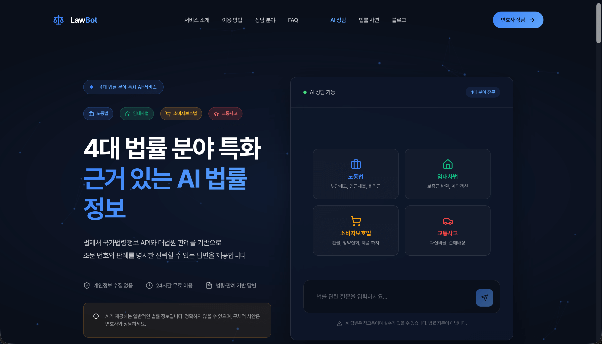
  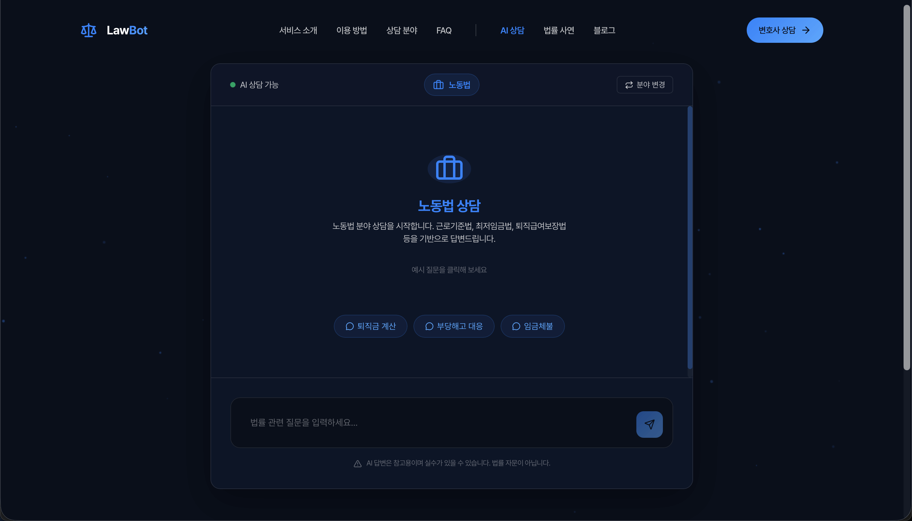
  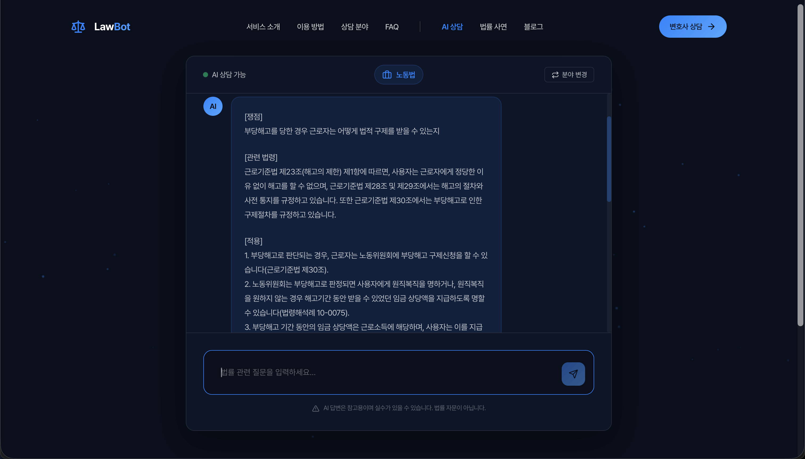
</p>

<p align="center">
  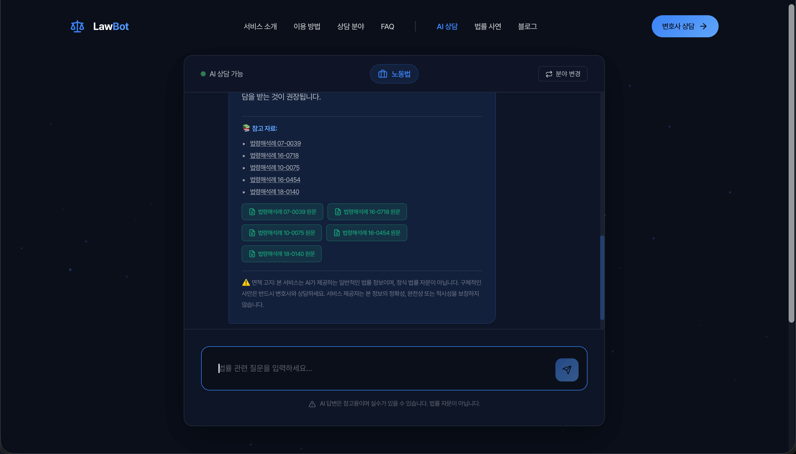
  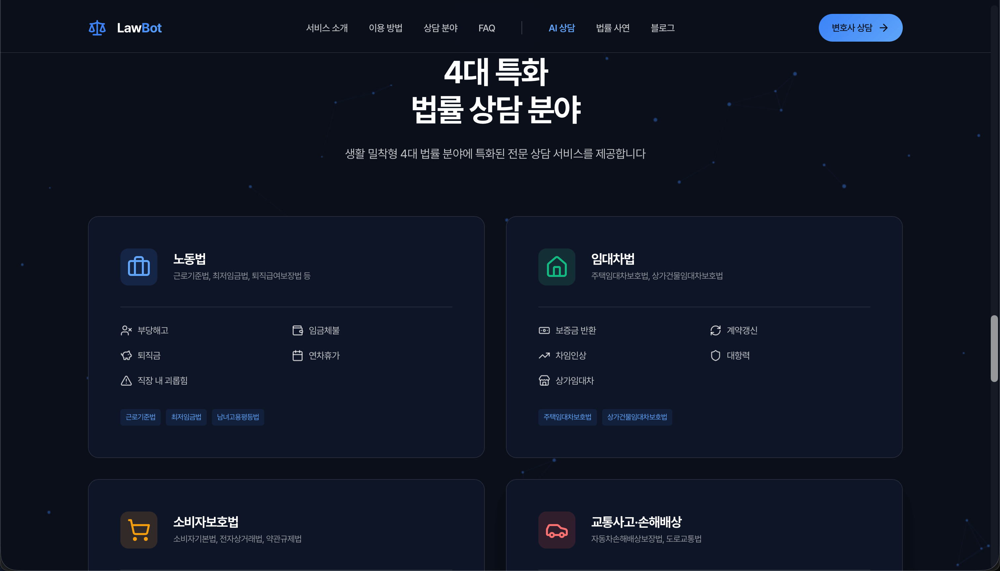
  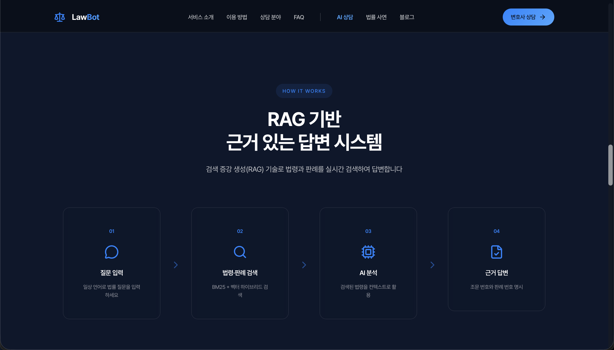
</p>

<p align="center">
  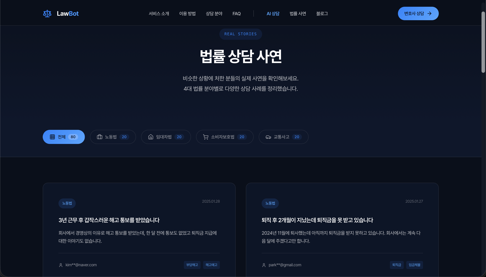
  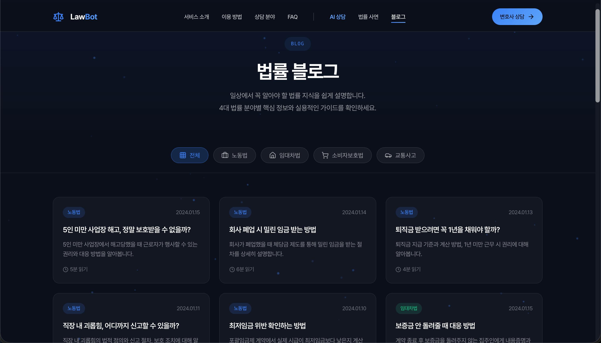
  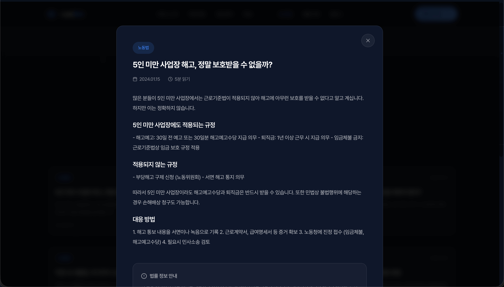
</p>

<p align="center">
  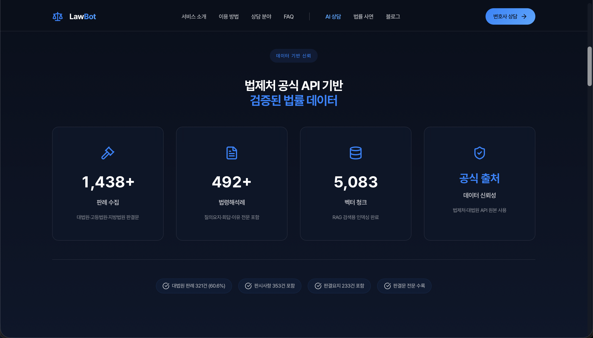
  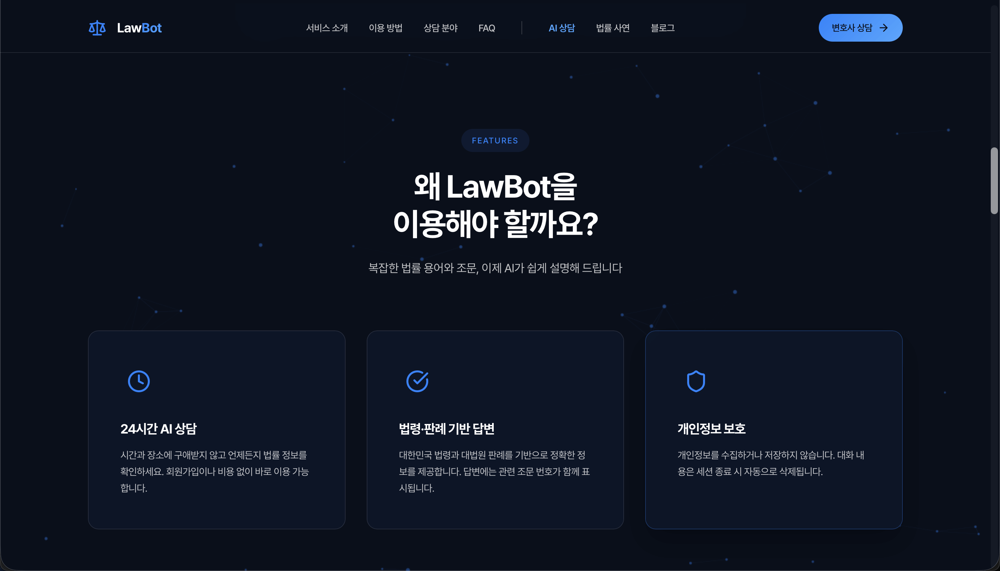
</p>

| Screen | Description |
|--------|-------------|
| Landing Page | Hero section with 4 legal domain badges and chat preview |
| Chat Interface | Labor law consultation with suggested questions |
| AI Response | IRAC structured answer with legal citations |
| Source References | Clickable source links to original documents |
| 4 Legal Domains | Category cards for labor, lease, consumer, traffic |
| RAG Process | 4-step RAG pipeline visualization |
| Legal Stories | Real case studies filtered by category |
| Blog | Legal knowledge articles by domain |
| Blog Detail | Article modal with regulations and advice |
| Data Statistics | 1,438+ precedents, 492+ interpretations, 5,083 chunks |
| Features | 24/7 AI consultation, citation-based answers, privacy |

---

## Tech Stack

### Backend

| Category | Technology | Version | Description |
|----------|------------|---------|-------------|
| Framework | FastAPI | 0.109+ | Async REST API server |
| Language | Python | 3.11 | Runtime environment |
| Validation | Pydantic | 2.6+ | Request/response validation |
| Server | Uvicorn | 0.27+ | ASGI server |
| Vector DB | ChromaDB | 0.4.24+ | Persistent vector storage |
| Search | rank-bm25 | 0.2.2 | BM25 keyword search |

**Backend Architecture:**

```
backend/
├── main.py                     # FastAPI entry point, lifespan management
│                               # - CORS middleware configuration
│                               # - Static file serving (Next.js build)
│                               # - Health check endpoint
├── api/
│   ├── chat.py                 # POST /api/chat
│   │                           # - Category auto-detection from keywords
│   │                           # - RAG pipeline execution
│   │                           # - Disclaimer injection
│   └── search.py               # POST /api/search
│                               # - Hybrid search (BM25 + Vector)
│                               # - Result ranking and filtering
└── core/
    ├── embeddings.py           # Local sentence-transformers wrapper
    ├── llm.py                  # Multi-provider LLM client
    │                           # - Mistral AI (primary)
    │                           # - Groq API (fallback)
    │                           # - Retry logic with exponential backoff
    ├── retriever.py            # Hybrid search engine
    │                           # - ChromaDB vector search
    │                           # - BM25 keyword search
    │                           # - Score fusion (alpha weighting)
    ├── rag_service.py          # Unified RAG pipeline
    │                           # - Context building
    │                           # - Source extraction
    │                           # - Answer generation
    └── prompts.py              # System prompts and templates
                                # - IRAC response structure
                                # - Legal disclaimer
```

**Core Technical Implementation:**

1. **Hybrid Search (retriever.py)**
   - Vector similarity search via ChromaDB (cosine distance)
   - BM25 keyword search with tokenization
   - Score fusion: `final_score = alpha * vector_score + (1 - alpha) * bm25_score`
   - Default alpha: 0.5 (equal weighting)

2. **Multi-Provider LLM (llm.py)**
   - Primary: Mistral AI (open-mixtral-8x7b, 1B tokens/month free)
   - Fallback: Groq API (llama-3.1-70b-versatile)
   - Automatic retry with exponential backoff on rate limits
   - Streaming support for real-time responses

3. **RAG Pipeline (rag_service.py)**
   - Query embedding via sentence-transformers
   - Hybrid search with category filtering
   - Context construction with source metadata
   - LLM generation with legal domain prompts

### AI/ML

| Category | Technology | Version | Description |
|----------|------------|---------|-------------|
| Embeddings | multilingual-e5-base | - | 768-dim multilingual embeddings |
| Framework | sentence-transformers | 2.6+ | Local embedding inference |
| LLM (Primary) | Mistral AI | open-mixtral-8x7b | Korean-optimized, free tier |
| LLM (Fallback) | Groq | llama-3.1-70b | Fast inference, rate limited |
| ML Runtime | PyTorch | 2.0+ | CPU-only inference |

**Embedding Model Specifications:**

| Model | Dimensions | Size | Memory | Use Case |
|-------|------------|------|--------|----------|
| e5-small | 384 | ~120MB | Low | Not recommended |
| e5-base | 768 | ~560MB | Medium | Production (selected) |
| e5-large | 1024 | ~2.2GB | High | OOM risk on free tier |

### Frontend

| Category | Technology | Version | Description |
|----------|------------|---------|-------------|
| Framework | Next.js | 14.1+ | React framework with App Router |
| Language | TypeScript | 5.3+ | Type-safe JavaScript |
| Styling | Tailwind CSS | 3.4+ | Utility-first CSS |
| HTTP Client | Axios | 1.6+ | Promise-based HTTP client |
| Build | Static Export | - | output: 'export' for FastAPI serving |

**Frontend Architecture:**

```
frontend/
├── next.config.js              # Static export configuration
│                               # - output: 'export'
│                               # - images.unoptimized: true
├── src/
│   ├── app/
│   │   ├── layout.tsx          # Root layout with metadata
│   │   └── page.tsx            # Main chat interface
│   ├── components/
│   │   ├── ChatWindow.tsx      # Chat container component
│   │   ├── MessageBubble.tsx   # Message display component
│   │   └── Disclaimer.tsx      # Legal disclaimer component
│   └── styles/
│       └── globals.css         # Global styles and Tailwind imports
└── out/                        # Static build output (served by FastAPI)
```

### Landing Page (web/)

| Category | Technology | Version | Description |
|----------|------------|---------|-------------|
| Animation | GSAP | 3.12 | Scroll-triggered animations |
| Scroll | ScrollTrigger | - | GSAP plugin for scroll events |
| Icons | Lucide | - | SVG icon library |
| Forms | Web3Forms | - | Serverless form handling |
| Deployment | Vercel | - | Static site hosting |

### Infrastructure

| Category | Technology | Description |
|----------|------------|-------------|
| Container | Docker | Multi-stage build |
| Hosting | HuggingFace Spaces | Free tier (16GB RAM, 2 vCPU) |
| Landing | Vercel | Static site CDN |
| Vector Storage | ChromaDB (Persistent) | ./vectordb directory |

---

## Architecture

### System Architecture

```
+-------------------------------------------------------------------------+
|                              Client Layer                               |
|  +------------------+  +------------------+  +------------------------+  |
|  |   Landing Page   |  |   Chat Frontend  |  |    Mobile Browser      |  |
|  |   (Vercel)       |  |   (Next.js SSG)  |  |                        |  |
|  +------------------+  +------------------+  +------------------------+  |
|         |                      |                        |               |
|         | lawbot-public.       | wonchulhee-korean-     |               |
|         | vercel.app           | law-chatbot.hf.space   |               |
+---------|----------------------|------------------------|---------------+
          |                      |                        |
          v                      v                        v
+-------------------------------------------------------------------------+
|                           HuggingFace Spaces                            |
|  +-------------------------------------------------------------------+  |
|  |                    Docker Container (Port 7860)                   |  |
|  |  +---------------------+  +------------------------------------+  |  |
|  |  |   FastAPI Server    |  |        Static Files               |  |  |
|  |  |   /api/chat         |  |        Next.js Build (./out)      |  |  |
|  |  |   /api/search       |  +------------------------------------+  |  |
|  |  |   /api/health       |                                          |  |
|  |  +---------------------+                                          |  |
|  |           |                                                       |  |
|  |           v                                                       |  |
|  |  +---------------------+  +------------------------------------+  |  |
|  |  |   RAG Service       |  |        LLM Manager                |  |  |
|  |  |   - Embeddings      |  |        - Mistral AI (Primary)     |  |  |
|  |  |   - Retriever       |  |        - Groq API (Fallback)      |  |  |
|  |  +---------------------+  +------------------------------------+  |  |
|  |           |                          |                            |  |
|  |           v                          v                            |  |
|  |  +---------------------+  +------------------------------------+  |  |
|  |  |   ChromaDB          |  |        External APIs              |  |  |
|  |  |   (./vectordb)      |  |        api.mistral.ai             |  |  |
|  |  |   ~5000 chunks      |  |        api.groq.com               |  |  |
|  |  +---------------------+  +------------------------------------+  |  |
|  +-------------------------------------------------------------------+  |
+-------------------------------------------------------------------------+
```

### RAG Data Flow

```
[User Question]
    |
    | "퇴직금 계산 방법이 궁금합니다"
    v
+------------------+
| Category Detect  |  <-- Keyword matching (CATEGORY_KEYWORDS)
| -> "labor"       |
+------------------+
    |
    v
+------------------+
| Query Embedding  |  <-- sentence-transformers (e5-base)
| -> 768-dim vector|      Local inference (~100ms)
+------------------+
    |
    v
+------------------+
| Hybrid Search    |  <-- ChromaDB + BM25
| top_k=5          |      alpha=0.5 (score fusion)
| category=labor   |
+------------------+
    |
    v
+------------------+
| Context Build    |  <-- Format search results
| [1] 판례 123456  |      Add source metadata
| [2] 해석례 789   |
+------------------+
    |
    v
+------------------+
| LLM Generation   |  <-- Mistral AI / Groq
| System Prompt    |      IRAC structure
| + RAG Context    |      max_tokens=1024
+------------------+
    |
    v
+------------------+
| Response         |
| - Answer (IRAC)  |
| - Sources list   |
| - Disclaimer     |
+------------------+
```

### Deployment Architecture

```
+------------------+     +------------------+     +------------------+
|    GitHub        |     |  HuggingFace     |     |    Vercel        |
|  (GITHUB_REPO)   |---->|  Spaces          |     |  (LANDING_URL)   |
|  (main branch)   |     |  (Docker)        |     |  (web/ folder)   |
+------------------+     +------------------+     +------------------+
        |                        |                        |
        | git push               | Auto-build             | Auto-deploy
        v                        v                        v
+------------------+     +------------------+     +------------------+
| Dockerfile       |     | Container        |     | Static Site      |
| - Node.js build  |     | - Port 7860      |     | - index.html     |
| - Python runtime |     | - 16GB RAM       |     | - contact.html   |
| - Data indexing  |     | - Health check   |     | - story/         |
+------------------+     +------------------+     +------------------+
```

---

## Project Structure

```
lawbot/
├── CLAUDE.md                           # Project context and specifications
├── Dockerfile                          # Multi-stage Docker build
│                                       # Stage 1: Node.js -> Next.js build
│                                       # Stage 2: Python build environment
│                                       # Stage 3: Runtime image
├── .env.example                        # Environment variables template
│
├── backend/
│   ├── main.py                         # FastAPI application entry
│   │                                   # - Lifespan management
│   │                                   # - CORS configuration
│   │                                   # - Static file mounting
│   │                                   # - Version: 0.5.1
│   ├── api/
│   │   ├── chat.py                     # /api/chat endpoint
│   │   │                               # - ChatRequest/ChatResponse models
│   │   │                               # - Category auto-detection
│   │   │                               # - RAG pipeline integration
│   │   └── search.py                   # /api/search endpoint
│   │                                   # - SearchRequest/SearchResponse models
│   │                                   # - Hybrid search execution
│   ├── core/
│   │   ├── embeddings.py               # EmbeddingsManager class
│   │   │                               # - sentence-transformers wrapper
│   │   │                               # - encode() / encode_batch()
│   │   ├── llm.py                      # LLMManager class
│   │   │                               # - Mistral AI / Groq API
│   │   │                               # - generate() / stream_generate()
│   │   │                               # - Retry logic with backoff
│   │   ├── retriever.py                # Retriever class
│   │   │                               # - ChromaDB client
│   │   │                               # - BM25 index
│   │   │                               # - hybrid_search()
│   │   ├── rag_service.py              # RAGService class
│   │   │                               # - Unified pipeline
│   │   │                               # - search() / build_context()
│   │   │                               # - generate_answer() / process()
│   │   └── prompts.py                  # Prompt templates
│   │                                   # - SYSTEM_PROMPT_LABOR_LAW
│   │                                   # - RAG_PROMPT_TEMPLATE
│   │                                   # - DISCLAIMER
│   └── requirements.txt                # Python dependencies
│
├── frontend/
│   ├── package.json                    # Node.js dependencies
│   ├── next.config.js                  # Next.js configuration
│   │                                   # - output: 'export'
│   │                                   # - images.unoptimized: true
│   ├── tailwind.config.js              # Tailwind CSS configuration
│   ├── postcss.config.js               # PostCSS configuration
│   └── src/
│       ├── app/
│       │   ├── layout.tsx              # Root layout
│       │   └── page.tsx                # Chat page
│       ├── components/
│       │   ├── ChatWindow.tsx          # Chat UI container
│       │   ├── MessageBubble.tsx       # Message bubble component
│       │   └── Disclaimer.tsx          # Legal disclaimer
│       └── styles/
│           └── globals.css             # Global styles
│
├── data/
│   ├── collect/
│   │   ├── law_drf_client.py           # law.go.kr API client
│   │   │                               # - search_precedents()
│   │   │                               # - search_interpretations()
│   │   │                               # - get_precedent_detail()
│   │   ├── collect_all_categories.py   # Multi-category data collector
│   │   │                               # - 4 legal domains
│   │   │                               # - Keyword-based search
│   │   │                               # - Detail fetching
│   │   └── law_go_kr.py                # Legacy API wrapper
│   ├── process/
│   │   └── index_cases.py              # Vector DB indexing pipeline
│   │                                   # - CaseChunk dataclass
│   │                                   # - chunk_precedent()
│   │                                   # - chunk_interpretation()
│   │                                   # - Batch embedding generation
│   └── raw/
│       └── categories/                 # JSONL data files
│           ├── labor_precedents_*.jsonl
│           ├── labor_interpretations_*.jsonl
│           └── ...
│
├── vectordb/                           # ChromaDB persistent storage
│                                       # - Collection: law_cases
│                                       # - ~5000 chunks
│
├── web/                                # Landing page (Vercel)
│   ├── index.html                      # Main landing page
│   ├── contact.html                    # Contact form (Web3Forms)
│   ├── chat.html                       # Embedded chat page
│   ├── styles.css                      # Main stylesheet
│   ├── chat.css                        # Chat-specific styles
│   ├── script.js                       # GSAP animations, Lucide icons
│   ├── chat.js                         # Chat functionality
│   ├── vercel.json                     # Vercel configuration
│   ├── blog/
│   │   ├── index.html                  # Blog listing
│   │   ├── blog.css                    # Blog styles
│   │   └── blog.js                     # Blog functionality
│   └── story/                          # Legal case stories (64 cases)
│       ├── index.html                  # Story listing
│       ├── story.css                   # Story styles
│       ├── story.js                    # Story filtering
│       ├── stories-data.js             # Story metadata
│       ├── labor/                      # 20 labor law cases
│       ├── housing/                    # 14 lease law cases
│       ├── consumer/                   # 15 consumer protection cases
│       └── traffic/                    # 15 traffic accident cases
│
└── models/                             # LLM models (if local)
```

---

## Design Patterns

### Backend Patterns

| Pattern | Location | Implementation | Purpose |
|---------|----------|----------------|---------|
| Repository | retriever.py | `Retriever` class | Abstract data access |
| Service | rag_service.py | `RAGService` class | Business logic encapsulation |
| Factory | llm.py | Provider auto-selection | LLM client instantiation |
| Strategy | llm.py | Mistral/Groq providers | Interchangeable LLM backends |
| Decorator | main.py | `@asynccontextmanager` | Lifespan management |

**Service Pattern Example (rag_service.py):**

```python
class RAGService:
    def __init__(self, embeddings_manager, retriever, llm_manager):
        self.embeddings = embeddings_manager
        self.retriever = retriever
        self.llm = llm_manager

    def process(self, question: str, top_k: int = 5, category_filter: str = None) -> RAGResult:
        # 1. Search
        search_results = self.search(question, top_k, category_filter)
        # 2. Build context
        context = self.build_context(search_results)
        # 3. Extract sources
        sources = self.extract_sources(search_results)
        # 4. Generate answer
        answer = self.generate_answer(question, context)

        return RAGResult(answer=answer, sources=sources, context=context, disclaimer=self.disclaimer)
```

**Factory Pattern Example (llm.py):**

```python
class LLMManager:
    def __init__(self, mistral_api_key=None, groq_api_key=None, provider=None):
        # Auto-select provider: Mistral priority
        if provider:
            self.provider = provider
        elif mistral_api_key:
            self.provider = "mistral"
        elif groq_api_key:
            self.provider = "groq"
        else:
            raise ValueError("No API key provided")

        # Set API URL based on provider
        self.api_url = MISTRAL_API_URL if self.provider == "mistral" else GROQ_API_URL
```

### Frontend Patterns

| Pattern | Location | Implementation | Purpose |
|---------|----------|----------------|---------|
| Component | components/*.tsx | React functional components | UI composition |
| Container | ChatWindow.tsx | State management | Logic separation |
| Presenter | MessageBubble.tsx | Props-driven display | Reusable UI |

---

## API Specification

### Core Endpoints

| Endpoint | Method | Auth | Rate Limit | Description |
|----------|--------|------|------------|-------------|
| /api/chat | POST | None | - | RAG-based legal consultation |
| /api/search | POST | None | - | Hybrid search for documents |
| /api/health | GET | None | - | Health check with module status |

### POST /api/chat

**Request:**

```json
{
  "message": "[노동법 관련 질문] 퇴직금 계산 방법이 궁금합니다",
  "conversation_id": "optional-uuid"
}
```

**Response:**

```json
{
  "conversation_id": "uuid-string",
  "answer": "[쟁점] 퇴직금 계산 기준에 관한 질문입니다...",
  "sources": ["판례 2020다12345", "법령해석례 2021-0001"],
  "disclaimer": "본 서비스는 AI가 제공하는 일반적인 법률 정보이며..."
}
```

### POST /api/search

**Request:**

```json
{
  "query": "퇴직금 계산",
  "limit": 5
}
```

**Response:**

```json
{
  "results": [
    {
      "id": "prec_123_summary",
      "content": "[판시사항] 퇴직금 산정 기준...",
      "metadata": {
        "type": "precedent",
        "category": "labor",
        "case_number": "2020다12345",
        "source": "판례 2020다12345"
      },
      "score": 0.85
    }
  ],
  "total_count": 5
}
```

### GET /api/health

**Response:**

```json
{
  "status": "healthy",
  "service": "law-chatbot-api",
  "version": "0.5.1",
  "build_id": "embeddings-fix",
  "build_date": "2026-01-29",
  "modules": {
    "embeddings": true,
    "retriever": true,
    "llm": true
  }
}
```

---

## Configuration

### Environment Variables

```bash
# ===================
# AI Model Settings
# ===================
# Embedding model (HuggingFace model ID)
EMBEDDINGS_MODEL_NAME=intfloat/multilingual-e5-base

# ChromaDB storage path
CHROMADB_PATH=./vectordb

# ===================
# LLM API Keys
# ===================
# Mistral AI (Primary - 1B tokens/month free)
MISTRAL_API_KEY=your-mistral-key

# Groq API (Fallback - fast but rate limited)
GROQ_API_KEY=your-groq-key

# ===================
# Server Settings
# ===================
# Port (7860 required for HF Spaces)
PORT=7860

# Host binding
HOST=0.0.0.0

# Debug mode
DEBUG=False

# ===================
# CORS Settings
# ===================
# Allowed origins (comma-separated) - Set your production URLs
ALLOWED_ORIGINS=http://localhost:3000,http://localhost:7860
```

---

## Development Setup

### Requirements

| Tool | Version | Purpose |
|------|---------|---------|
| Python | 3.11+ | Backend runtime |
| Node.js | 20+ | Frontend build |
| Docker | 20+ | Container build |
| Git | 2.x | Version control |

### Local Development

```bash
# 1. Clone repository (use your GITHUB_REPO_URL from .env)
git clone $GITHUB_REPO_URL
cd law

# 2. Backend setup
python -m venv venv
source venv/bin/activate  # or venv\Scripts\activate on Windows
pip install -r backend/requirements.txt

# 3. Frontend setup
cd frontend
npm ci
npm run build
cd ..

# 4. Environment variables
cp .env.example .env
# Edit .env with your API keys

# 5. Data collection (optional - uses law.go.kr API)
python data/collect/collect_all_categories.py --all-enabled --max-items 30

# 6. Index data to vector DB
python data/process/index_cases.py --collection law_cases

# 7. Run server
python -m uvicorn backend.main:app --host 0.0.0.0 --port 7860 --reload
```

### Testing

```bash
# Backend - API test
curl -X POST http://localhost:7860/api/chat \
  -H "Content-Type: application/json" \
  -d '{"message": "퇴직금 계산 방법이 궁금합니다"}'

# Health check
curl http://localhost:7860/api/health

# Search test
curl -X POST http://localhost:7860/api/search \
  -H "Content-Type: application/json" \
  -d '{"query": "부당해고", "limit": 5}'
```

---

## Deployment

### HuggingFace Spaces (Docker)

**Dockerfile (Multi-stage build):**

```dockerfile
# Stage 1: Frontend build
FROM node:20-slim AS frontend-builder
WORKDIR /app/frontend
COPY frontend/package*.json ./
RUN npm ci
COPY frontend/ .
RUN npm run build

# Stage 2: Python dependencies
FROM python:3.11-slim AS python-builder
WORKDIR /app
RUN apt-get update && apt-get install -y build-essential
COPY backend/requirements.txt .
RUN pip install --no-cache-dir --target=/app/packages -r requirements.txt

# Stage 3: Runtime
FROM python:3.11-slim
WORKDIR /app
RUN apt-get update && apt-get install -y curl
COPY --from=python-builder /app/packages /usr/local/lib/python3.11/site-packages/
COPY backend/ ./backend/
COPY data/ ./data/
COPY --from=frontend-builder /app/frontend/out ./frontend/out

# Data collection and indexing at build time
RUN python data/collect/collect_all_categories.py \
    --enable-category labor,lease,consumer,traffic \
    --all-enabled --max-items 30 --detail-limit 60 \
    && python data/process/index_cases.py --collection law_cases

EXPOSE 7860
HEALTHCHECK --interval=30s --timeout=10s --start-period=60s \
    CMD curl -f http://localhost:7860/api/health || exit 1
CMD ["python", "-m", "uvicorn", "backend.main:app", "--host", "0.0.0.0", "--port", "7860"]
```

**Deployment Steps:**

```bash
# 1. Push to GitHub
git push origin main

# 2. Push to HuggingFace Spaces
git remote add hf https://huggingface.co/spaces/wonchulhee/korean-law-chatbot
git push hf main

# 3. Set secrets in HF Spaces Settings
# - MISTRAL_API_KEY
# - GROQ_API_KEY
# - HF_TOKEN (for model downloads)
```

### Vercel (Landing Page)

**vercel.json:**

```json
{
  "headers": [
    {
      "source": "/(.*)",
      "headers": [
        {"key": "Cache-Control", "value": "public, max-age=31536000, immutable"}
      ]
    }
  ],
  "cleanUrls": true,
  "trailingSlash": false
}
```

**Deployment:**

```bash
cd web
npx vercel --prod
```

---

## Data Statistics

### Vector Database

| Metric | Value |
|--------|-------|
| Total Chunks | ~5,000 |
| Embedding Dimensions | 768 |
| Collection Name | law_cases |
| Storage | ChromaDB (Persistent) |

### Data Distribution

| Category | Precedents | Interpretations | Total Chunks | Source |
|----------|------------|-----------------|--------------|--------|
| Labor (labor) | ~600 | ~200 | ~2,000 | law.go.kr |
| Lease (lease) | ~400 | ~150 | ~1,200 | law.go.kr |
| Consumer (consumer) | ~350 | ~100 | ~1,000 | law.go.kr |
| Traffic (traffic) | ~300 | ~100 | ~800 | law.go.kr |

### Chunk Types

| Type | Description | Avg Length |
|------|-------------|------------|
| summary | Case summary | ~500 chars |
| holding | Case holding | ~800 chars |
| full_text | Full text | ~2,000 chars |
| question | Interpretation question | ~300 chars |
| answer | Interpretation answer | ~400 chars |
| reason | Interpretation reason | ~1,500 chars |

### Categories (4 Legal Domains)

| Category ID | Name | Keywords |
|------------|------|----------|
| labor | Labor Law | severance, dismissal, wages, leave |
| lease | Lease Law | deposit, renewal, priority |
| consumer | Consumer Protection | refund, cancellation, defect |
| traffic | Traffic Accidents | fault ratio, compensation, insurance |

---

## Performance

| Metric | Value |
|--------|-------|
| Embedding latency | ~100ms |
| Hybrid search | ~50-100ms |
| LLM generation | 3-8s |
| Total response | 5-15s |
| Model size (e5-base) | ~560MB |
| Container size | ~2-3GB |

---

## Version

| Component | Version | Release Date |
|-----------|---------|--------------|
| Backend API | 0.5.1 | 2026-01-29 |
| Build ID | embeddings-fix | - |
| Embeddings | e5-base (768d) | - |
| LLM | open-mixtral-8x7b | - |

---

## License

MIT License

This project uses data from the following public sources:

| Source | License | URL |
|--------|---------|-----|
| law.go.kr | CC BY (Public Data) | https://open.law.go.kr |
| Supreme Court Precedents | Public Domain | via law.go.kr API |

**Data Accuracy:**
- All precedents collected via official law.go.kr API
- Case numbers, dates, and court names are 100% accurate
- Summaries and holdings are original text from court records

---

## Disclaimer

This service provides AI-generated general legal information, not formal legal advice.
For specific cases, always consult with a licensed attorney.
